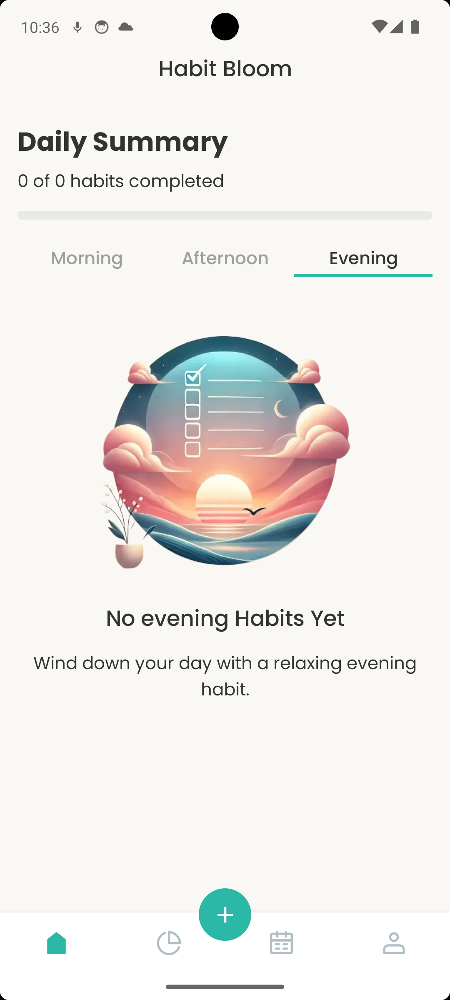
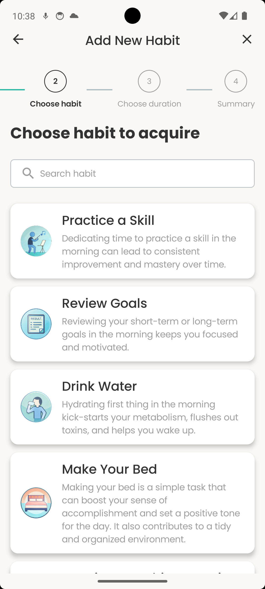
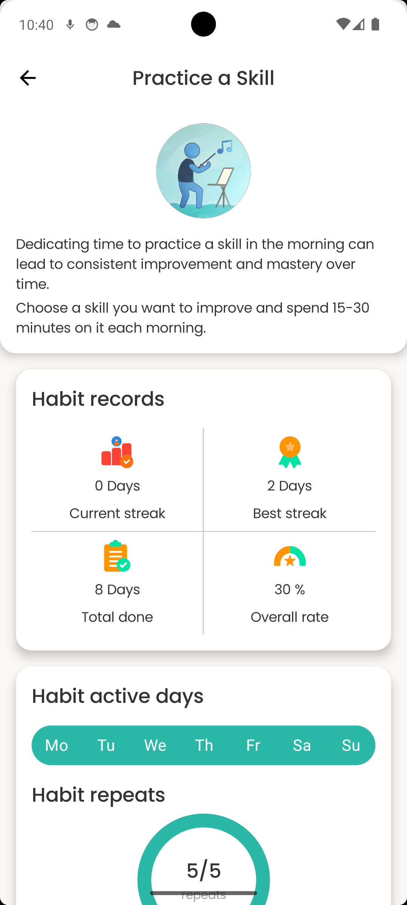
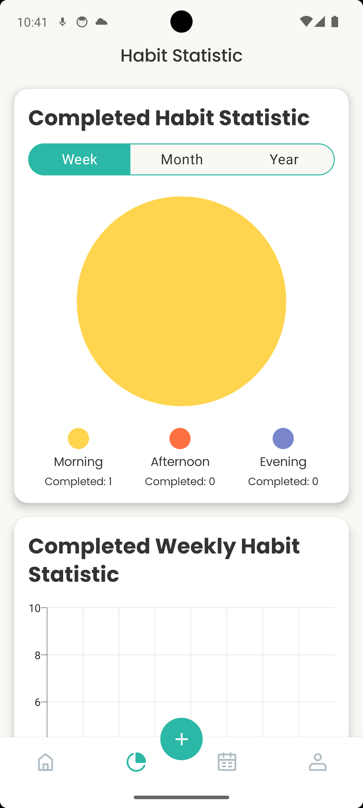

# HabitBloom

<p align="center">
  
</p>

**HabitBloom** is a modern, cross-platform habit tracking application built with Kotlin Multiplatform. Designed to help users build positive habits through beautiful visualization and consistent tracking, HabitBloom works seamlessly across Android and iOS.

## Features

- **Cross-platform**: Built with Kotlin Multiplatform, runs natively on Android and iOS
- **Beautiful UI**: Modern, clean interface using Jetpack Compose Multiplatform
- **Habit tracking**: Create, manage, and track personal habits
- **Time-based organization**: Morning, afternoon, and evening habit categorization
- **Visual progress**: Track streaks and view your daily/weekly habit completion
- **Image support**: Add custom images to your habits
- **Offline support**: Local SQLDelight database with cloud synchronization
- **User authentication**: Secure login via Firebase Authentication
- **Cloud storage**: Store habit data in Firebase Firestore with images in Supabase Storage

## Screenshots

<p align="center">
  
  
  
  
</p>

## Architecture

HabitBloom follows a clean architecture approach with the following components:

- **Presentation Layer**: Compose UI, Screen Models (ViewModels), UI States
- **Domain Layer**: Repositories, Use Cases, Domain Models
- **Data Layer**: Remote Data Sources, Local Data Sources, DTOs

### Technology Stack

- **UI**: Jetpack Compose Multiplatform
- **Navigation**: Voyager
- **Dependency Injection**: Koin
- **Local Database**: SQLDelight
- **Remote Data**: Firebase Firestore, Supabase Storage
- **Authentication**: Firebase Auth
- **Image Loading**: Coil
- **Networking**: Ktor
- **Logging**: Napier
- **Date/Time**: KotlinX DateTime
- **Asynchronous Programming**: Kotlin Coroutines & Flow

## Project Structure

```
├── composeApp/
│   ├── src/
│   │   ├── androidMain/       # Android-specific code
│   │   ├── commonMain/        # Shared code between platforms
│   │   │   ├── kotlin/
│   │   │   │   ├── auth/      # Authentication features
│   │   │   │   ├── core/      # Core components, UI, utilities
│   │   │   │   ├── di/        # Dependency injection setup
│   │   │   │   ├── habits/    # Habit tracking features
│   │   │   │   │   ├── data/
│   │   │   │   │   ├── domain/
│   │   │   │   │   └── presentation/
│   │   │   │   ├── profile/   # User profile features
│   │   │   │   └── utils/     # Utility functions
│   │   │   └── resources/     # Shared resources
│   │   └── iosMain/           # iOS-specific code
│   └── build.gradle.kts       # Gradle build configuration
└── iosApp/                    # iOS app wrapper
```

## Setup Instructions

### Prerequisites

- Android Studio Flamingo or newer
- Xcode 15+ (for iOS development)
- JDK 17+
- Kotlin 2.0.0+

### Getting Started

1. **Clone the repository**

```bash
git clone https://github.com/yourusername/HabitBloom.git
cd HabitBloom
```

2. **Set up Firebase**

- Create a new Firebase project at [Firebase Console](https://console.firebase.google.com/)
- Add Android and iOS apps to your Firebase project
- Download the `google-services.json` file and place it in `composeApp/`
- Download the `GoogleService-Info.plist` file and place it in `iosApp/iosApp/`

3. **Set up Supabase**

- Create a new Supabase project at [Supabase](https://supabase.com/)
- Set up a storage bucket named `habit_images` with public access
- Update the Supabase URL and anon key in `SupabaseConfig.kt`

```kotlin
// In SupabaseConfig.kt
private const val SUPABASE_URL = "YOUR_SUPABASE_URL"
private const val SUPABASE_ANON_KEY = "YOUR_SUPABASE_ANON_KEY"
```

4. **Build and run**

- For Android: Open the project in Android Studio and run the `composeApp` configuration
- For iOS: Open `iosApp/iosApp.xcworkspace` in Xcode and run the project

## Permissions

### Android

The application requires the following permissions:

```xml
<uses-permission android:name="android.permission.INTERNET" />
<uses-permission android:name="android.permission.READ_MEDIA_IMAGES" />
<uses-permission android:name="android.permission.READ_EXTERNAL_STORAGE" android:maxSdkVersion="32" />
```

### iOS

For iOS, the following permissions are required in the Info.plist:

- NSPhotoLibraryUsageDescription

## Architecture Details

### Image Handling Flow

1. **Selection**: User selects an image from the gallery using the platform-specific image picker
2. **Local Storage**: Image is temporarily stored in the app's cache directory
3. **Upload**: When creating a habit, the image is uploaded to Supabase Storage
4. **Storage**: The Supabase Storage URL is stored with the habit in Firebase Firestore
5. **Display**: Images are loaded and displayed using Coil

### Dependency Injection

We use Koin for dependency injection with the following main modules:

- `appModule`: Main application module
- `platformModule`: Platform-specific implementations
- `remoteDataModule`: Firebase and Supabase services
- `localDataModule`: SQLDelight database services
- `habitsDomainModule`: Habit feature domain layer
- `habitsDataModule`: Habit feature data layer

## Contributing

Contributions are welcome! Please feel free to submit a Pull Request.

1. Fork the repository
2. Create your feature branch (`git checkout -b feature/amazing-feature`)
3. Commit your changes (`git commit -m 'Add some amazing feature'`)
4. Push to the branch (`git push origin feature/amazing-feature`)
5. Open a Pull Request

## License

This project is licensed under the MIT License - see the [LICENSE](LICENSE) file for details.

## Contact

For any questions or inquiries, please contact [your.email@example.com](mailto:your.email@example.com)

---

<p align="center">
  Made with ❤️ using Kotlin Multiplatform
</p>