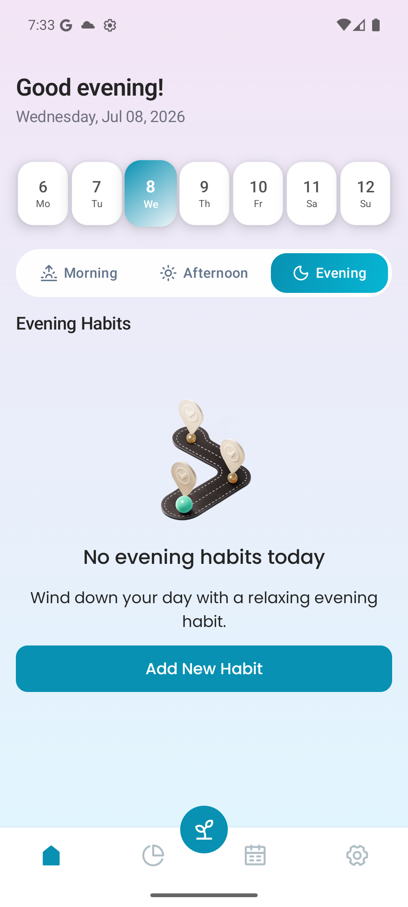
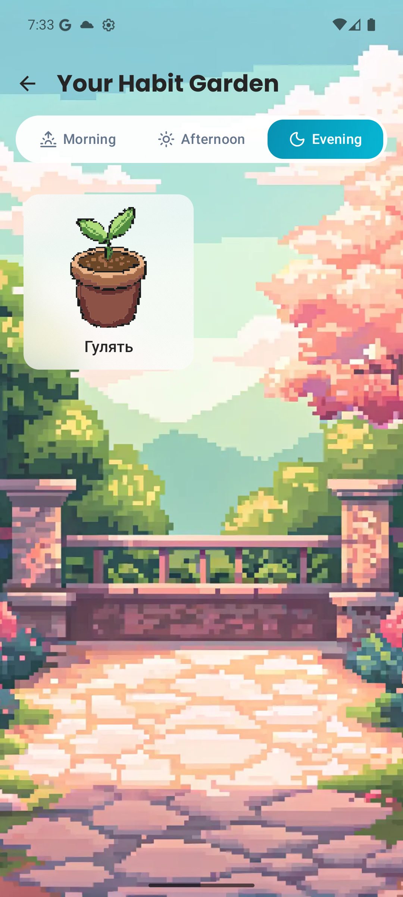
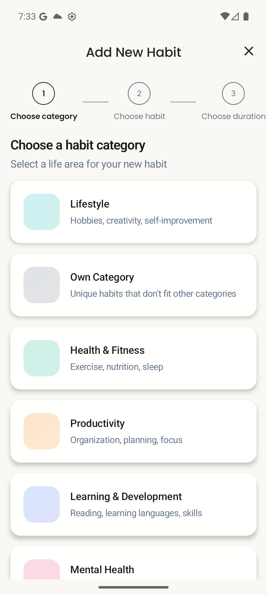
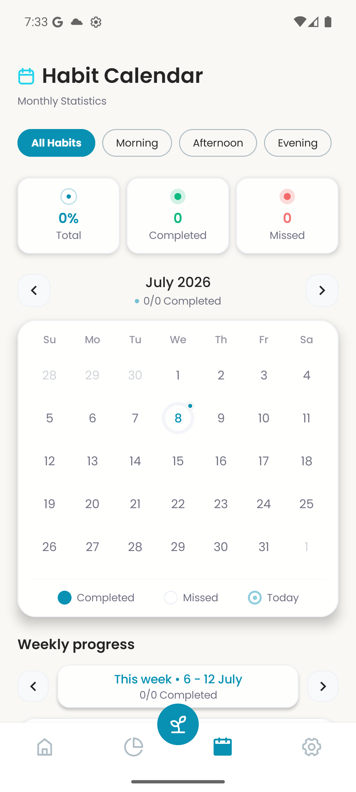
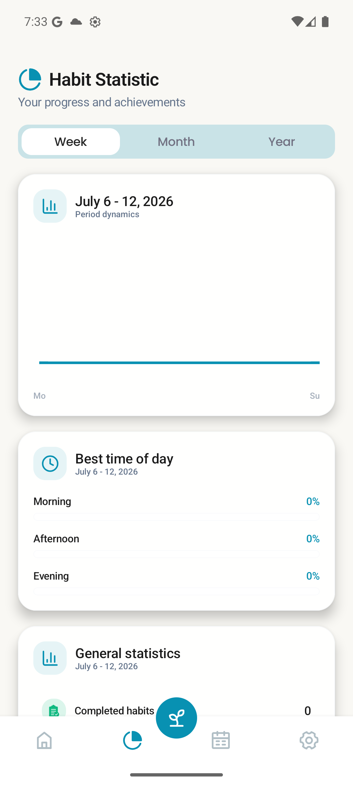
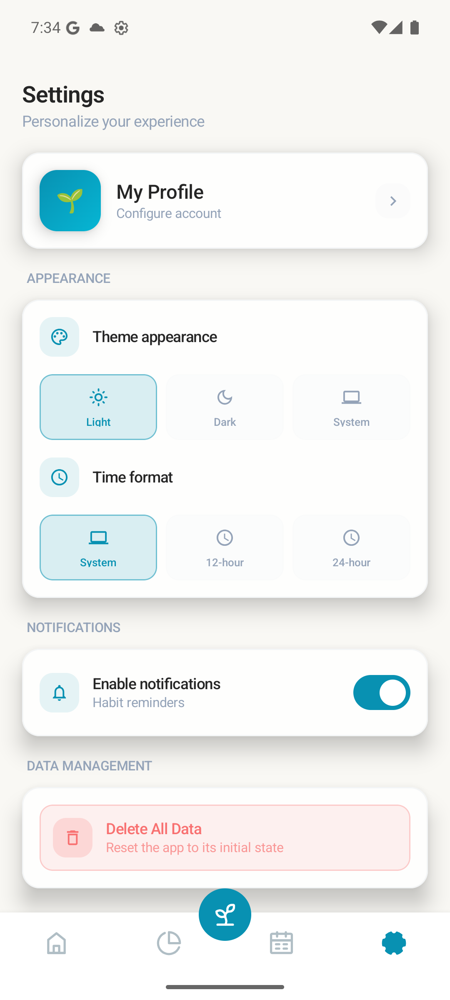

<p align="center">
  
</p>

<h1 align="center">HabitBloom</h1>

<p align="center">
  <strong>Build habits that grow into something you can see.</strong>
</p>

<p align="center">
  A calm, cross-platform habit tracker that turns daily consistency into a living digital garden.
</p>

<p align="center">
  
  
  
  <a href="LICENSE"></a>
</p>

## Build habits that grow

HabitBloom makes progress tangible. Plan a habit for the morning, afternoon, or evening, check it off when it is done, and watch its flower develop in your garden. Calendar history, streaks, and focused statistics help you understand the pattern behind the progress.

- **A visual reward loop** — every active habit becomes a flower that changes as consistency builds.
- **Flexible routines** — start from curated categories or create a personal habit with its own schedule, duration, image, and reminder.
- **Useful reflection** — review completion by day, week, month, year, and time of day.
- **A shared product on two platforms** — the core experience, domain logic, and data layer are written once with Kotlin Multiplatform.

## See HabitBloom in action

<table>
  <tr>
    <td align="center" width="33%">
      <br />
      <strong>Plan the day</strong><br />
      <sub>Habits organized around your natural rhythm.</sub>
    </td>
    <td align="center" width="33%">
      <br />
      <strong>Grow a garden</strong><br />
      <sub>A visual home for every habit you nurture.</sub>
    </td>
    <td align="center" width="33%">
      <br />
      <strong>Shape your routine</strong><br />
      <sub>A guided flow from category to schedule.</sub>
    </td>
  </tr>
</table>

<table>
  <tr>
    <td align="center" width="33%">
      <br />
      <strong>Review the calendar</strong><br />
      <sub>Daily history and weekly progress in one place.</sub>
    </td>
    <td align="center" width="33%">
      <br />
      <strong>Understand progress</strong><br />
      <sub>Weekly, monthly, and yearly completion insights.</sub>
    </td>
    <td align="center" width="33%">
      <br />
      <strong>Make it yours</strong><br />
      <sub>Theme, time format, reminders, and profile controls.</sub>
    </td>
  </tr>
</table>

## What you can do

- Create habits from focused categories or define a custom one.
- Organize routines into morning, afternoon, and evening.
- Configure duration, repeat days, reminders, and custom images.
- Complete daily habits and track current and best streaks.
- Grow a flower garden with progress-based growth stages.
- Explore completion history in a monthly calendar.
- Compare progress across week, month, and year views.
- Switch between light, dark, and system themes.
- Use English or Ukrainian throughout the application.
- Keep working with local SQLDelight persistence and synchronize account data through cloud services.

## How it works

```text
Create a habit  →  Add it to your daily rhythm  →  Mark it complete
       ↑                                                ↓
Review insights  ←  Follow streaks and history  ←  Grow its flower
```

The application is organized around presentation, domain, and data responsibilities. Compose screens communicate with ViewModels through immutable UI state and events; domain repositories coordinate habit rules; local and remote data sources handle persistence and synchronization.

## Built with Kotlin Multiplatform

| Area | Technology |
| --- | --- |
| Shared UI | Compose Multiplatform |
| Language | Kotlin 2.3 |
| Navigation | Navigation Compose with type-safe routes |
| Dependency injection | Koin |
| Local persistence | SQLDelight |
| Cloud data and authentication | Firebase Firestore and Firebase Auth |
| Image storage | Supabase Storage |
| Networking | Ktor |
| Image loading | Coil |
| Concurrency | Coroutines and Flow |

Android and iOS share the product UI, navigation, business rules, persistence contracts, and most integrations. Platform source sets provide native database drivers, notifications, permissions, image picking, locale management, and system UI behavior.

## Project structure

```text
HabitBloom/
├── composeApp/
│   └── src/
│       ├── commonMain/
│       │   ├── composeResources/       # Shared strings, icons, and illustrations
│       │   └── kotlin/.../
│       │       ├── app/                # Application entry and root state
│       │       ├── core/               # Design system, navigation, and services
│       │       ├── di/                 # Koin modules
│       │       └── screens/            # Habits, garden, calendar, stats, settings
│       ├── androidMain/                # Android platform implementations
│       └── iosMain/                    # iOS platform implementations
├── iosApp/                             # Native iOS host application
└── screenshots/                        # Product gallery assets
```

## Getting started

### Requirements

- Android Studio with Android SDK 36
- JDK 17
- Xcode 15 or newer for the iOS target

### Run on Android

```bash
git clone https://github.com/Tarrras/HabitBloom.git
cd HabitBloom
./gradlew :composeApp:installDebug
```

Launch the installed `com.horizondev.habitbloom` application from Android Studio or a connected device.

### Run on iOS

Open `iosApp/iosApp.xcodeproj` in Xcode, select the `iosApp` scheme, configure a development team, and run on an iOS simulator or device.

### Service configuration

HabitBloom uses Firebase for authentication and cloud data, plus Supabase Storage for habit images. For your own deployment:

1. Register Android and iOS applications in Firebase.
2. Provide `composeApp/google-services.json` and `iosApp/iosApp/GoogleService-Info.plist`.
3. Configure the Supabase project values used by `SupabaseConfig.kt`.
4. Keep local credentials and signing values out of version control.

## Contributing

Issues and focused pull requests are welcome. Please describe the user-facing change, keep platform behavior aligned where applicable, and verify the affected Android and iOS flows.

## License

HabitBloom is available under the [MIT License](LICENSE).

<p align="center">
  <strong>Plant a habit. Grow a rhythm.</strong>
</p>
